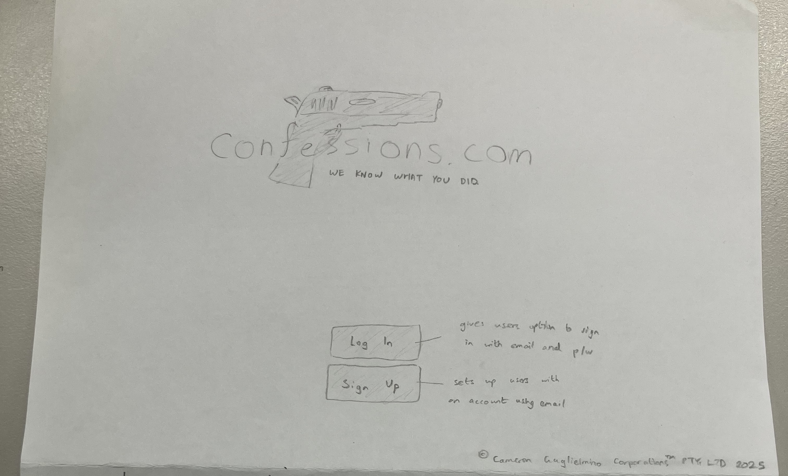
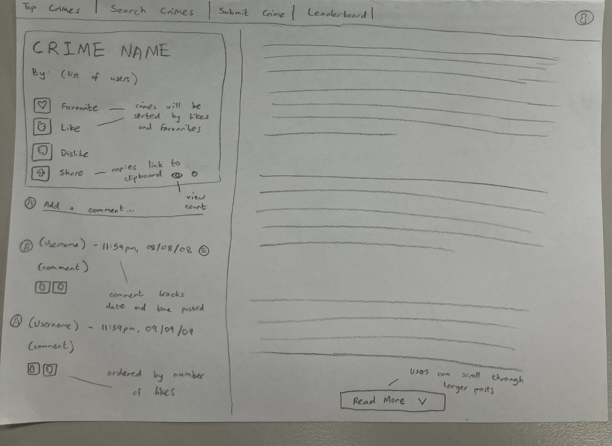
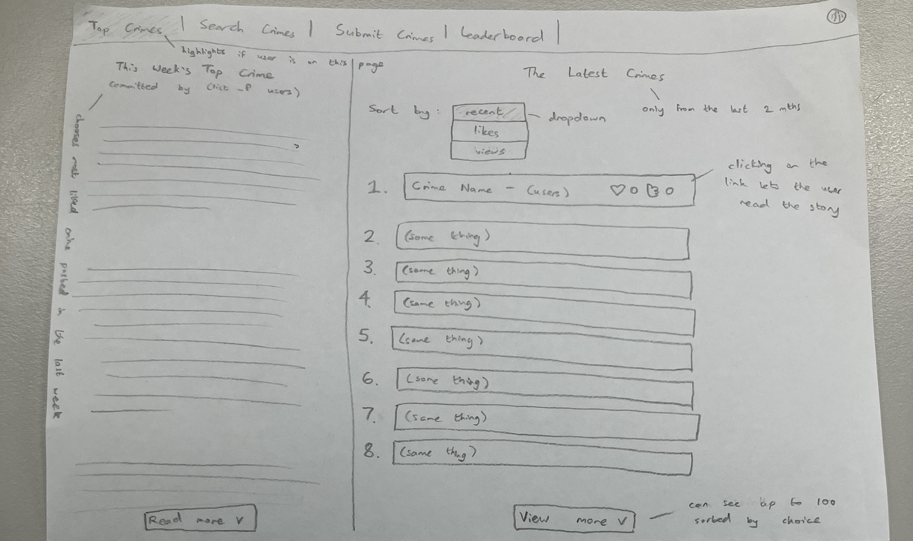
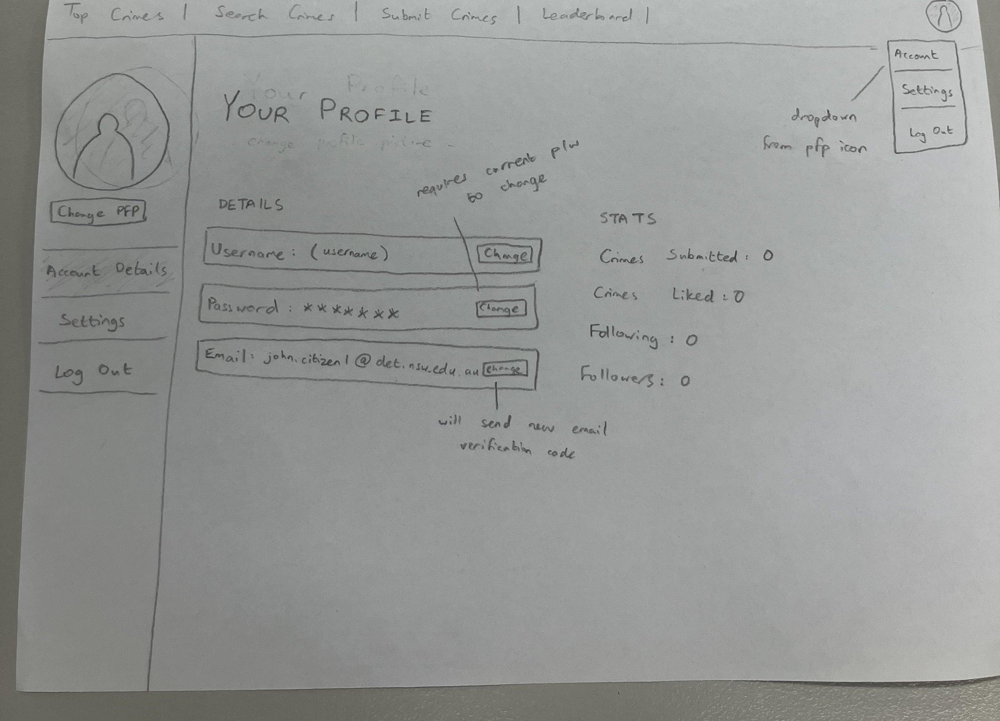
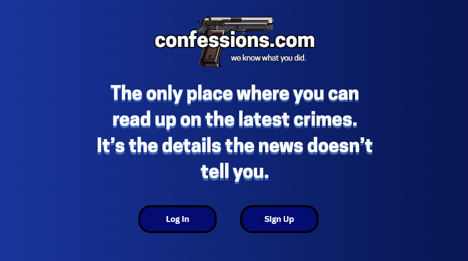
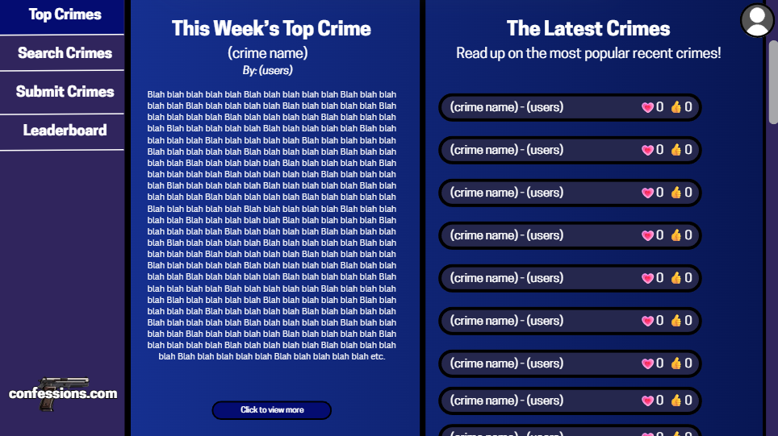
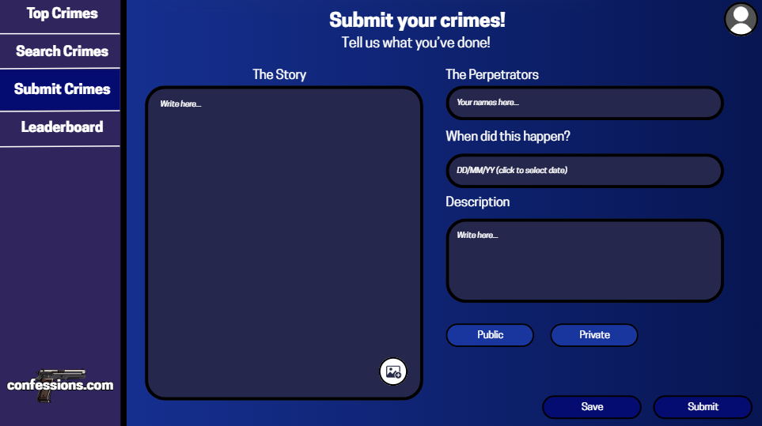
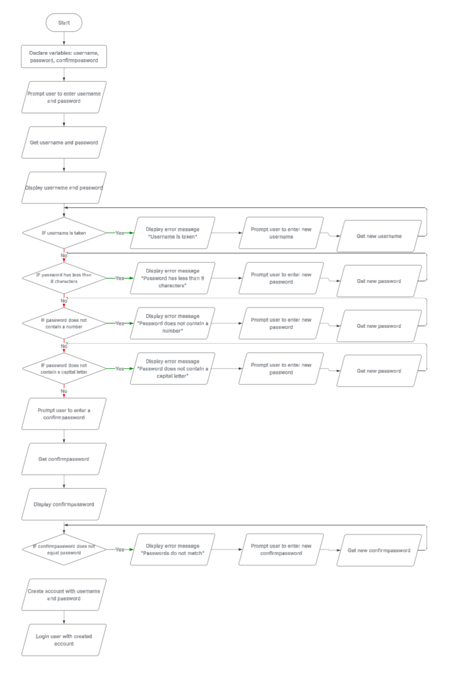

# Cameron Guglielmino - CPT AT 3 Documentation

## **Week 1 - Project Definition and Requirements** ##
I want to create a platform for users to be able to read crime stories. To accomplish this, users will sign up to the platform, and they will be able to read stories published by other users. Users will be able to like other crime stories, and the most popular/liked stories will appear on the front page. Users can also post their own crime stories.

Users will also be able to customise their profile with a username, profile picture and about me. They can also follow other users, and they will receive notifications when that user publishes a story. Users can also set their password to secure their account and prevent others from logging into it.

I will use the design created on Figma last year as a template for a new design for the website and improve upon some aspects of the original that were not as strong (e.g colour palette, typography, user interactions). I also want to remove the 'crime chat' sections of the original design to encourage wider use of the platform without promoting organised crime.

### **Functional Requirements**

- Users should be able to sign up to the site and log in with the same account at a later date.
- Users should be able to customise their profile (e.g profile picture, username, password)
- Users should be able to view and follow other users.
- Users should be able to post stories onto the platform.

### **Non-Functional Requirements**

- The app should be able to load webpages in under 2 seconds.
- The app should be easy to navigate for new users.
- The system should be able to support at least 1000 different users.
- The system should be able to store info of each different user (e.g username, password, id)

### **Client Feedback**

- Need to add a fourth functional requirement (has been added)
- Need to add more detail onto some of the functional/non-functional requirements

## **Week 2 - Basic Design of UI, Hierachy and Interactive Elements**

### **Design Table**:

| Aspect of Design | Description |
| ---------------- | ----------- |
| Landing Page | The landing page should display the logo, and give the user the option to either log in or sign out. When signing up or logging in, the user has the option to enable 'Keep Me Signed In', where this page is skipped and the user is automatically logged in. This option will automatically disable if the user does not log in for 14 days or logs out manually. |
| Navigation Bar | This bar will display in every page except for the landing page. The bar will have options to take users directly to the Top Crimes, Search Crimes, Submit Crimes and Leaderboard pages, as well as an option to edit their account and settings through a dropdown menu attached to an icon in the top-right corner displaying the user's profile picture. |
| Top Crimes Page | This is the page the user will be directed to upon being logged in.  On the left, there will be a display of the most liked crime posted in the last week (titled 'This Week's Top Crime'). On the right, there will be a display of 'The Latest Crimes', where the user can sort the crimes by most recent, most liked, and most viewed. This display will show the first 100 crimes ordered by the user's preference, and disply the number of likes, favourites and views on each one. The user should be able to scroll through them. Clicking on one of them will take the user to an individual page so they can read the crime. |
| Individual Crime Page | This is the page where the user will be able to read an individual crime. On the left will be a display of the name of the crime, the user(s) who posted it, and an option to favourite/like/dislike/share the crime, which will also display the number of each as well as the number of views. Underneath that, there will be a comment section where users can read and post comments about the crime, sorted by number of likes and displaying the username of the commenter as well as the date and time of when it was posted. On the right will be the posted crime, with the option to scroll through it if the crime is long enough. |
| Profile Settings Page | This is the page where the user can edit their profile. On the left will be a sidebar allowing the user to view different pages of their settings (Account Details/Settings) and allow them to log out of their account. On the Account Details page, the user can change their username, password and email, however changing the password and email will require the user to input their password and the email will send the new email address a verification code. The user will also be able to see how many crimes they've submitted/liked, how many followers they have, and how many other users they're following. Hovering over the following stat will show a small list of the profile pictures of people they're following. |
| Colour Palette | Primary: Gray, Secondary: White, Accent: Navy Blue. The accent colour will likely be used on buttons to add contrast. |
| Other Pages | Search Crimes, Submit Crimes, Leaderboard, Settings, Login/Signup Page (not included in prototype sketch) |

### **Images of Sketch**

**Landing Page**



**Individual Crime Page**



**Top Crimes Page**



**Profile Settings Page**



### **Client Feedback**

- Landing page is very empty with a lot of blank space, needs more interactions or text as the only features on there are login/signup buttons
- Annotations are not very detailed, more detail has been added to the Design Table
- No colour scheme or typography design choices present, need to add those more visually in the Alternative Design as it is difficult to visualise typography/colours on a drawing


## **Week 3 - Alternative Design - Playing with Possibilities**

### **Design Table**:

| Aspect of Design | Description |
| ---------------- | ----------- |
| Landing Page | The landing page is similar to the original design. I wanted to add some text to prevent it looking very empty, as before it only had a large image of the logo, but functionality-wise it is the same. The page still feels lacking in terms of interactions for the user, so for the actual project I want to add more features to this page. |
| Navigation Bar | The navigation bar has been moved from the top to the left side of the screen. I believe the navigation bar is more fitting on the top rather than the side as there is much more blank space when it is on the side, leading to it looking more empty. To fill some of the empty space, I added an image of the confessions.com logo. |
| Top Crimes Page | This page is the most similar to previous designs. The main difference is the navigation bar being moved and the colours/typography, so the main functions of the page are the same as before. The 'click to view more' button uses the accent colour to make it stand out. |
| Submit Crimes Page | The submit crimes page needed to have a lot of features to add to one story so the entire page wouldn't be taken up by a box to type in. The page has options to write a story, add a list of names, add the date, write a description, attach images and set to different modes of viewing (Public, Private). It also has an option to save your progress and finish later, so the longer stories don't have to be written in one go. |
| Colour Palette | Primary: Blue, Secondary: Dark Indigo, Accent: Dark Blue. Since the last prototype of this website used a mainly grey and black colour scheme, I wanted to change the colour so the website wasn't only monochrome colours. The background colour of each page is a blue gradient. This palette has a less serious feel to it compared to the grey and black from before, so for the actual project this is the palette I would use, or have a toggleable dark theme with the original grey/black colour scheme. |
| Typography | The font used for majority of the text is Cooper Hewitt. I didn't have a specific font design in mind for this, so I used a less serious font than before since the colour scheme for this design isn't as intense (mainly blue compared to mainly grey and black). For the actual project, I want to choose a more serious-looking font. |

### **Images of Design (Canva)**

**Landing Page**



**Top Crimes Page**



**Submit Crimes Page**



### **Client Feedback**

- No annotations present on design images (will be added onto the design table instead)
- Landing page is less empty than in the previous iteration of design, but could still use more detail in final project
- Designs are overall very similar to the previous iteration from last week, with some minor design changes and improvements such as the navigation bar moved to the side


## **Week 4 - Designing algorithms - Functional Steps for User Focused Design**

### **Basic Algorithm - Creating an Account - Pseudocode**

```
1. Declare variables: username, password, confirmpassword, email, verificationcode, matchverificationcode
2. Prompt user to enter a username, password and email
3. Get username, password and email
4. Display username, password and email
5. IF username is taken, THEN
    5.1. DO
        5.1.1. Display error message "Username is taken"
        5.1.2. Prompt user to enter new username
        5.1.3. Get new username
    5.2. WHILE username is taken
6. IF password is less than 8 characters, THEN
    6.1. DO
        6.1.1. Display error message "Password is less than 8 characters"
        6.1.2. Prompt user to enter new password
        6.1.3. Get new password
    6.2. WHILE password is less than 8 characters
7. IF password does not contain a number
    7.1. DO
        7.1.1. Display error message "Password does not contain a number"
        7.1.2. Prompt user to enter new password
        7.1.3. Get new password
    7.2. WHILE password does not contain a number
8. IF password does not contain a capital letter
    8.1. DO
        8.1.1. Display error message "Password does not contain a capital letter"
        8.1.2. Prompt user to enter new password
        8.1.3. Get new password
    8.2. WHILE password does not contain a capital letter
9. ENDIF
10. Prompt user to enter a confirmpassword
11. Get confirmpassword
12. Display confirmpassword
13. IF confirmpassword does not match password, THEN
    13.1. DO
        13.1.1. Display error message "Passwords do not match"
        13.1.2. Prompt user to enter new confirmpassword
        13.1.3. Get confirmpassword
    13.2. WHILE confirmpassword does not equal password
13. ENDIF
14. Set verificationcode to random 6-digit integer
15. Send verificationcode to email
16. Prompt user to input matchverificationcode
17. IF matchverificationcode does not match verificationcode, THEN
    17.1. DO
        17.1.1. Display error message "Verification codes do not match"
        17.1.2. Prompt user to re-enter verificationcode
        17.1.3. Get verificationcode
    17.2. WHILE matchverificationcode does not match verificationcode
18. Create account with username, password and email data
19. Log in user to platform
```

### **Flowchart Image**



### **Test Cases**

**Test Case ID:** AD-001

**Test Case Name:** Creating an account

**Preconditions:** User is not logged into an account

**Test Steps:**
1. User will enter a username and password.
2. User will click the 'Sign Up' button.
3. System will check for if the username matches with another existing account. If so, the user will be prompted to change their username until it is valid.
4. System will check for if the username meets some conditions (at least 8 characters, must have a number, must have a capital letter). If not, the user will be prompted to change their password until it is valid.
5. System will prompt the user to retype their password in 'Confirm password'.
6. System will check for if the confirm password matches the original. If not, the user will be prompted to retype it until they match.
7. System will send a randomly generated 6-digit verification code to the inputted email.
8. System will prompt the user to input the same 6-digit code.
9. System will check the verification codes match. If not, the user will be prompted to retype it until they match.
10. System will create the account with the correct username, password and email data.
11. User will be logged into the account.

**Expected Result:** Account is created with correct data and user is logged in with the account.

**Priority:** Very High


**Test Case ID:** AD-002

**Test Case Name:** Resetting account password

**Preconditions:** User already has an account

**Test Steps:**
1. User will click the 'Reset password' button.
2. User will input their current username and email address.
3. System will send a randomly generated 6-digit verification code to the inputted email.
4. System will prompt the user to input the same 6-digit code.
5. System will check the verification codes match. If not, the user will be prompted to retype it until they match.
6. User will be prompted to enter a new password.
7. System will update the password through the account data.
8. User will be logged into the account.

**Expected Result:** Account data is correctly updated and user is logged in with the account.

**Priority:** High

### **Client Feedback**

- Need to fix up flowchart - inaccurate to pseudocode (will be changed), also there is a singular missing arrow that NEEDS fixing
- No usage of variables within test cases such as `username`, `password` etc


## **Week 5 - Setting Up for Development and Database Work (SQL)**

**20/8/25 - Initial Backend Setup**

- I first managed to install all the necessary dependencies for Python, VSCode, Flask, SQLite and Git-Bash. I progressed through the tutorial well at first, but I did get stuck on the `pip install flask` step as, when trying to put the command into Git-bash, it would respond with `Command not found`. Yi Ping assisted me in getting Flask to work.
- I set up the required file directory with folders for `static`, `templates`, `working_documents` and `database`, plus `database_manager.py` and `main.py`. Within the `database` folder I set up the SQLite Database with a few different files - one for the actual data (which will contain tables that can be imported with Excel) and a Query Editor which will contain the SQL queries. I managed to add the initial table from the `SETUP` docs, however I didn't yet understand how the tables worked.

**21/8/25 - Setting Up Database Tables**

- For this lesson, I aimed to figure out how the SQL tables worked and start adding the queries. I went through the SQL tutorial website and looked through the SQL course on Grok to revise the basic functions of SQL (since it had been a while since I'd done the course). After a bit, I remembered how SQL queries are structured with `SELECT * FROM`, `WHERE` and `ORDER BY`. I used SQL's `CREATE TABLE` and `INSERT INTO` functions to create a basic layout for two tables - `UserData` and `PostData` - however I realised I could generate the data using Mockaroo, which I would do tomorrow.

**22/8/25 - Populating Tables and Sorting Data with SQL**

- Using Mockaroo, I was able to add two tables of mock data with 1000 rows each, for both user and posts on the website. For `userData`, there are columns for `userID` (which is the primary key), `username`, `password`, `email` and `creationdate`. For `postData`, there are columns for `postID`, `username` (of whoever posted it), `post` (for the actual text), `postTime`, `public` (bool), `views` and `likes`. There were some columns that I forgot to add such as `postTitle`, `followers`, `following` and `description`, which will be added later.
- I added some queries for posts with over 2000 `likes` and over 90,000 `views`, which are both very basic for now. Later, I improved them and added some more queries so that there were five in total.
    - UserData: Select data from a specific user, sort by most recently created users.
    - PostData: Sort by the top 50 most liked/viewed posts, sort by posts within the last (timeframe).

### **Wk 6 - TBD**