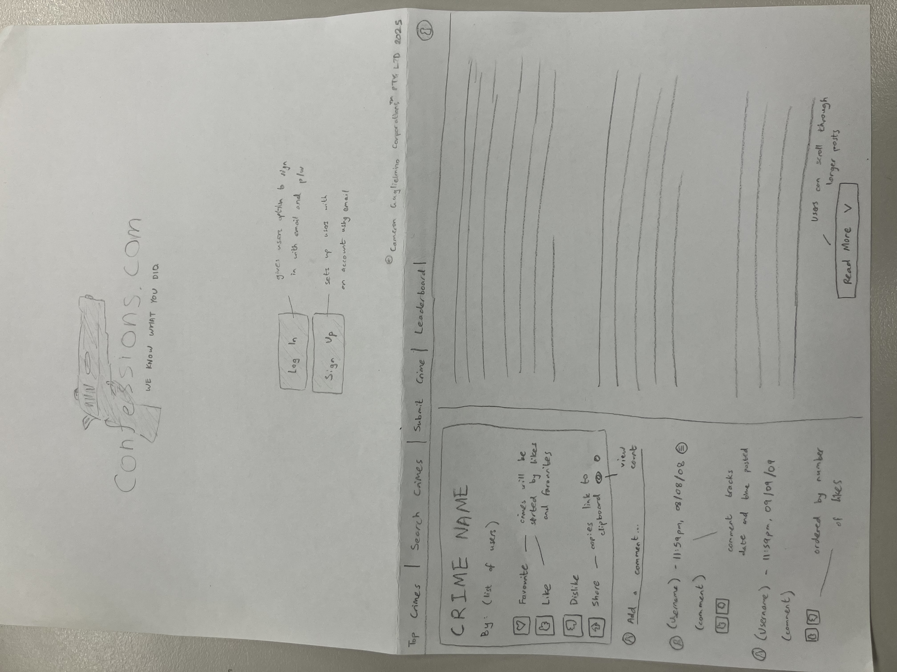
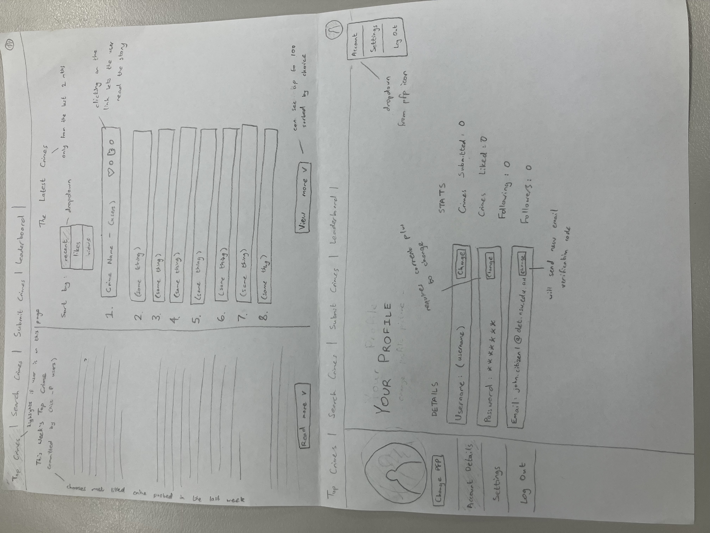

# Cameron Guglielmino - CPT AT 3 Documentation

## **Week 1 - Project Definition and Requirements** ##
I want to create a platform for users to be able to read crime stories. To accomplish this, users will sign up to the platform, and they will be able to read stories published by other users. Users will be able to like other crime stories, and the most popular/liked stories will appear on the front page.

Users will also be able to customise their profile with a username, profile picture and about me. They can also follow other users, and they will receive notifications when that user publishes a story. Users can also set their password.

### **Functional Requirements**

- Users should be able to sign up to the site and log in with the same account at a later date.
- Users should be able to customise their profile (e.g profile picture, username, password)
- Users should be able to view and follow other users.

### **Non-Functional Requirements**

- The app should be able to load webpages in under 2 seconds.
- The app should be easy to navigate for new users.
- The system should be able to support at least 1000 different users.
- The system should be able to store info of each different user (e.g username, password, id)

## **Week 2 - Basic Design of UI, Hierachy and Interactive Elements**

### **Design Table**:

| Aspect of Design | Description |
| -------- | -------- |
| Landing Page | The landing page should display the logo, and give the user the option to either log in or sign out. When signing up or logging in, the user has the option to enable 'Keep Me Signed In', where this page is skipped and the user is automatically logged in. This option will automatically disable if the user does not log in for 14 days or logs out manually. |
| Navigation Bar | This bar will display in every page except for the landing page. The bar will have options to take users directly to the Top Crimes, Search Crimes, Submit Crimes and Leaderboard pages, as well as an option to edit their account and settings through a dropdown menu attached to an icon in the top-right corner displaying the user's profile picture. |
| Top Crimes Page | This is the page the user will be directed to upon being logged in.  On the left, there will be a display of the most liked crime posted in the last week (titled 'This Week's Top Crime'). On the right, there will be a display of 'The Latest Crimes', where the user can sort the crimes by most recent, most liked, and most viewed. This display will show the first 100 crimes ordered by the user's preference, and disply the number of likes, favourites and views on each one. The user should be able to scroll through them. Clicking on one of them will take the user to an individual page so they can read the crime.|
| Individual Crime Page | This is the page where the user will be able to read an individual crime. On the left will be a display of the name of the crime, the user(s) who posted it, and an option to favourite/like/dislike/share the crime, which will also display the number of each as well as the number of views. Underneath that, there will be a comment section where users can read and post comments about the crime, sorted by number of likes and displaying the username of the commenter as well as the date and time of when it was posted. On the right will be the posted crime, with the option to scroll through it if the crime is long enough. |
| Profile Settings Page | This is the page where the user can edit their profile. On the left will be a sidebar allowing the user to view different pages of their settings (Account Details/Settings) and allow them to log out of their account. On the Account Details page, the user can change their username, password and email, however changing the password and email will require the user to input their password and the email will send the new email address a verification code. The user will also be able to see how many crimes they've submitted/liked, how many followers they have, and how many other users they're following. Hovering over the following stat will show a small list of the profile pictures of people they're following. |
| Colour Palette | Primary: Gray, Secondary: White, Accent: Navy Blue. The accent colour will likely be used on buttons to add contrast. |
| Other Pages | Search Crimes, Submit Crimes, Leaderboard, Settings, Login/Signup Page (not included in prototype sketch) |

### **Images of Sketch**

**Landing Page & Individual Crime Page**

**Top Crimes Page & Profile Settings Page**

## **Week 3 - Alternative Design - Playing with Possibilities**

### **Design Table**:

| Aspect of Design | Description |
| -------- | -------- |
| Landing Page | The landing page is similar to the original design. I wanted to add some text to prevent it looking very empty, as before it only had a large image of the logo, but functionality-wise it is the same. |
| Navigation Bar | The navigation bar has been moved from the top to the left side of the screen. I believe the navigation bar is more fitting on the top rather than the side as there is much more blank space when it is on the side, leading to it looking more empty. To fill some of the empty space, I added an image of the confessions.com logo. |
| Top Crimes Page | This page is the most similar to previous designs. The main difference is the navigation bar being moved and the colours/typography, so the main functions of the page are the same as before. The 'click to view more' button uses the accent colour to make it stand out. |
| Submit Crimes Page | The submit crimes page needed to have a lot of features to add to one story so the entire page wouldn't be taken up by a box to type in. The page has options to write a story, add a list of names, add the date, write a description, attach images and set to different modes of viewing (Public, Private). It also has an option to save your progress and finish later. |
| Colour Palette | Primary: Blue, Secondary: Dark Indigo, Accent: Dark Blue. Since the last prototype of this website used a mainly grey and black colour scheme, I wanted to change the colour so the website wasn't only monochrome colours. The background colour of each page is a blue gradient. |
| Typography | The font used for majority of the text is Cooper Hewitt. |

### **Images of Design (Canva)**

**Landing Page**

**Top Crimes Page**

**Submit Crimes Page**

## **Week 4 - TBD**